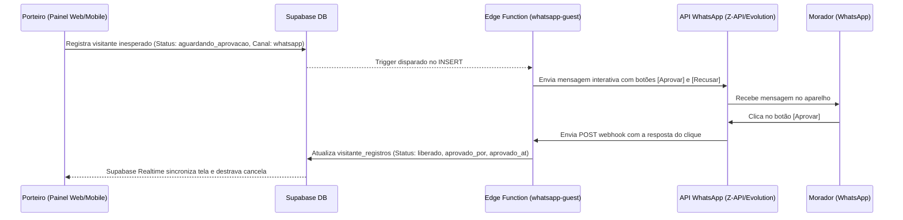

# Documento de Decisões de Arquitetura Técnica — MVP Fase 1

Este documento descreve as decisões de arquitetura técnica, modelagem de banco de dados, políticas de segurança de linha (RLS) e fluxos de integração para os quatro novos módulos do Condomeet no MVP Fase 1.

---

## 1. Central de Acordos Pix Express

### 1.1 Modelo de Dados (SQL)

Para suportar o fluxo de renegociação de inadimplência com auditoria contábil e desbloqueio imediato, criaremos o seguinte conjunto de tabelas:

```sql
-- 1. Tabela Principal de Acordos
CREATE TABLE IF NOT EXISTS public.financeiro_acordos (
    id                      UUID        PRIMARY KEY DEFAULT gen_random_uuid(),
    condominio_id           UUID        NOT NULL REFERENCES public.condominios(id) ON DELETE CASCADE,
    unidade_id              UUID        NOT NULL REFERENCES public.unidades(id) ON DELETE CASCADE,
    perfil_id               UUID        NOT NULL REFERENCES public.perfil(id) ON DELETE RESTRICT,
    
    valor_original          DECIMAL(12,2) NOT NULL,
    valor_desconto          DECIMAL(12,2) DEFAULT 0.00,
    valor_acordo            DECIMAL(12,2) NOT NULL,
    parcelas_qtd            INT         NOT NULL CHECK (parcelas_qtd > 0),
    status                  TEXT        NOT NULL DEFAULT 'pendente' CHECK (status IN ('pendente', 'ativo', 'finalizado', 'cancelado', 'atrasado')),
    
    termos_texto            TEXT        NOT NULL,
    assinatura_timestamp    TIMESTAMPTZ,
    assinatura_ip           INET,
    assinatura_user_agent   TEXT,
    
    created_at              TIMESTAMPTZ DEFAULT timezone('utc'::text, now()) NOT NULL,
    updated_at              TIMESTAMPTZ DEFAULT timezone('utc'::text, now()) NOT NULL
);

-- 2. Tabela de Parcelas do Acordo
CREATE TABLE IF NOT EXISTS public.financeiro_acordo_parcelas (
    id                      UUID        PRIMARY KEY DEFAULT gen_random_uuid(),
    acordo_id               UUID        NOT NULL REFERENCES public.financeiro_acordos(id) ON DELETE CASCADE,
    numero_parcela          INT         NOT NULL CHECK (numero_parcela > 0),
    valor                   DECIMAL(12,2) NOT NULL,
    data_vencimento         DATE        NOT NULL,
    status                  TEXT        NOT NULL DEFAULT 'pendente' CHECK (status IN ('pendente', 'pago', 'atrasado', 'cancelado')),
    
    gateway_invoice_id      TEXT, -- ID da fatura no Asaas
    gateway_invoice_url     TEXT, -- Link do PDF da fatura/boleto
    gateway_pix_qr_code     TEXT, -- Base64 ou string do QR Code Pix
    gateway_pix_copia_cola  TEXT, -- Chave Pix Copia e Cola
    
    data_pagamento          TIMESTAMPTZ,
    created_at              TIMESTAMPTZ DEFAULT timezone('utc'::text, now()) NOT NULL,
    updated_at              TIMESTAMPTZ DEFAULT timezone('utc'::text, now()) NOT NULL,
    UNIQUE (acordo_id, numero_parcela)
);

-- 3. Tabela de Vínculo com Faturamentos Originais
CREATE TABLE IF NOT EXISTS public.financeiro_acordo_faturamentos (
    acordo_id               UUID        REFERENCES public.financeiro_acordos(id) ON DELETE CASCADE,
    faturamento_id          UUID        REFERENCES public.faturamentos(id) ON DELETE RESTRICT,
    PRIMARY KEY (acordo_id, faturamento_id)
);

-- 4. Audit Log Imutável (Ledger Contábil)
CREATE TABLE IF NOT EXISTS public.financeiro_acordos_audit_log (
    id                      UUID        PRIMARY KEY DEFAULT gen_random_uuid(),
    acordo_id               UUID        REFERENCES public.financeiro_acordos(id) ON DELETE SET NULL,
    condominio_id           UUID        REFERENCES public.condominios(id) ON DELETE SET NULL,
    perfil_id               UUID        REFERENCES public.perfil(id) ON DELETE SET NULL,
    acao                    TEXT        NOT NULL, -- 'simulado', 'assinado', 'pagamento_parcela', 'unidade_desbloqueada', 'acordo_quebrado'
    dados                   JSONB       DEFAULT '{}'::jsonb,
    ip_address              INET,
    user_agent              TEXT,
    created_at              TIMESTAMPTZ DEFAULT timezone('utc'::text, now()) NOT NULL
);
```

### 1.2 Segurança RLS (Row Level Security)

```sql
ALTER TABLE public.financeiro_acordos ENABLE ROW LEVEL SECURITY;
ALTER TABLE public.financeiro_acordo_parcelas ENABLE ROW LEVEL SECURITY;
ALTER TABLE public.financeiro_acordos_audit_log ENABLE ROW LEVEL SECURITY;

-- 1.2.1 Políticas para financeiro_acordos
CREATE POLICY "Moradores podem ver seus próprios acordos" ON public.financeiro_acordos
    FOR SELECT TO authenticated
    USING (
        EXISTS (
            SELECT 1 FROM public.unidade_perfil up
            WHERE up.perfil_id = auth.uid()
              AND up.unidade_id = financeiro_acordos.unidade_id
        )
    );

CREATE POLICY "Moradores podem criar seus próprios acordos" ON public.financeiro_acordos
    FOR INSERT TO authenticated
    WITH CHECK (
        EXISTS (
            SELECT 1 FROM public.unidade_perfil up
            WHERE up.perfil_id = auth.uid()
              AND up.unidade_id = financeiro_acordos.unidade_id
        )
        AND perfil_id = auth.uid()
        AND status = 'pendente'
    );

CREATE POLICY "Moradores podem atualizar acordos pendentes para assinar" ON public.financeiro_acordos
    FOR UPDATE TO authenticated
    USING (
        EXISTS (
            SELECT 1 FROM public.unidade_perfil up
            WHERE up.perfil_id = auth.uid()
              AND up.unidade_id = financeiro_acordos.unidade_id
        )
        AND status = 'pendente'
    )
    WITH CHECK (
        status IN ('pendente', 'ativo')
    );

CREATE POLICY "Admins têm controle total sobre acordos do condomínio" ON public.financeiro_acordos
    FOR ALL TO authenticated
    USING (is_admin_of_condo(condominio_id));

-- 1.2.2 Políticas para financeiro_acordo_parcelas
CREATE POLICY "Moradores podem ver parcelas dos seus acordos" ON public.financeiro_acordo_parcelas
    FOR SELECT TO authenticated
    USING (
        EXISTS (
            SELECT 1 FROM public.financeiro_acordos a
            JOIN public.unidade_perfil up ON up.unidade_id = a.unidade_id
            WHERE a.id = financeiro_acordo_parcelas.acordo_id
              AND up.perfil_id = auth.uid()
        )
    );

CREATE POLICY "Admins têm controle total sobre parcelas" ON public.financeiro_acordo_parcelas
    FOR ALL TO authenticated
    USING (
        EXISTS (
            SELECT 1 FROM public.financeiro_acordos a
            WHERE a.id = financeiro_acordo_parcelas.acordo_id
              AND is_admin_of_condo(a.condominio_id)
        )
    );

-- 1.2.3 Políticas para financeiro_acordos_audit_log (MUTABLE=FALSE)
CREATE POLICY "Admins podem ler audit logs" ON public.financeiro_acordos_audit_log
    FOR SELECT TO authenticated
    USING (is_admin_of_condo(condominio_id));

CREATE POLICY "Moradores podem ler seus próprios audit logs" ON public.financeiro_acordos_audit_log
    FOR SELECT TO authenticated
    USING (
        EXISTS (
            SELECT 1 FROM public.unidade_perfil up
            WHERE up.perfil_id = auth.uid()
              AND up.unidade_id = (
                  SELECT unidade_id FROM public.financeiro_acordos a 
                  WHERE a.id = financeiro_acordos_audit_log.acordo_id
              )
        )
    );
-- NOTA: Sem políticas de UPDATE ou DELETE, garantindo a imutabilidade do log (ledger).
```

### 1.3 Fluxo de Webhook do Asaas e Desbloqueio Eleitoral

O fluxo de processamento de pagamento Pix do Asaas garante a atualização em menos de 60 segundos (NFR10 exige < 5s de sincronização do banco com a tela do morador):

1.  **Gatilho:** Morador paga o Pix da 1ª parcela. O Asaas envia um POST para a Supabase Edge Function `/asaas-webhook`.
2.  **Validação de Segurança:** A Edge Function decodifica a assinatura criptográfica (`asaas-access-token` vs variável de ambiente secreta).
3.  **Processamento da Parcela:**
    *   Atualiza o status da parcela (`financeiro_acordo_parcelas`) para `'pago'`.
    *   Preenche `data_pagamento = NOW()`.
4.  **Desbloqueio Eleitoral Automático (Trigger `trg_after_parcela_paga`):**
    *   Se for a parcela 1 (`numero_parcela = 1`), atualiza o acordo (`financeiro_acordos`) para `status = 'ativo'`.
    *   Desmarca a unidade: `unidades.bloqueada_assembleia = false`.
    *   Cancela os faturamentos originais no banco: `status_pagamento = 'cancelado'` na tabela `faturamentos` para os registros vinculados.
    *   Insere no `financeiro_acordos_audit_log` as ações correspondentes.
5.  **Notificação Realtime:** O Supabase Realtime detecta a alteração em `unidades.bloqueada_assembleia` e atualiza a UI do usuário no painel de assembleias imediatamente.

---

## 2. Dashboard Multi-condomínio

### 2.1 Latência < 3s e Arquitetura de Consultas (Pre-fetching)

Para possibilitar que o Síndico Profissional troque de contexto entre múltiplos condomínios sem lentidão:

1.  **Administradora Bypass:** Relação no banco usando `administradora_id` em `perfil` e `condominios`, permitindo queries centralizadas.
2.  **RPC Supabase para Métricas Consolidadas:** Evita queries N+1 e resolve todos os KPIs (Inadimplência, SOS ativos, encomendas pendentes) em um único payload JSON estruturado.

```sql
CREATE OR REPLACE FUNCTION public.get_consolidated_condo_metrics(condo_ids UUID[])
RETURNS JSONB
LANGUAGE plpgsql
SECURITY DEFINER
AS $$
DECLARE
  v_result JSONB;
BEGIN
  -- Verifica se o usuário autenticado tem permissão de administração para TODOS os condo_ids solicitados
  IF EXISTS (
    SELECT 1 FROM unnest(condo_ids) AS cid
    WHERE NOT is_admin_of_condo(cid)
  ) THEN
    RAISE EXCEPTION 'Acesso negado para um ou mais condomínios solicitados.';
  END IF;

  SELECT json_build_object(
    'timestamp', now(),
    'metrics', (
      SELECT json_agg(
        json_build_object(
          'condominio_id', c.id,
          'nome', c.nome,
          'total_unidades', (SELECT COUNT(*) FROM public.unidades WHERE condominio_id = c.id),
          'inadimplencia_valor', COALESCE((SELECT SUM(valor_total) FROM public.faturamentos WHERE condominio_id = c.id AND status_pagamento = 'vencido'), 0.00),
          'encomendas_pendentes', (SELECT COUNT(*) FROM public.encomendas WHERE condominio_id = c.id AND status = 'pending'),
          'sos_ativos', (SELECT COUNT(*) FROM public.sos_alertas WHERE condominium_id = c.id AND status = 'active')
        )
      )
      FROM public.condominios c
      WHERE c.id = ANY(condo_ids)
    )
  ) INTO v_result;
  
  RETURN v_result;
END;
$$;
```

3.  **Client-Side Caching (Next.js):**
    *   Utilização de bibliotecas como **SWR** ou **React Query** com tempo de invalidação (stale-while-revalidate) de 60 segundos.
    *   **Pre-fetching:** Ao passar o mouse sobre o dropdown do seletor de condomínios, o dashboard inicia o pre-fetching das métricas do condomínio destacado.

---

## 3. Assembleias Paperless

### 3.1 Alinhamento de Conformidade (Art. 1.335 do Código Civil)

A adimplência é checada de forma transparente no banco de dados para evitar fraudes eleitorais em assembleias:

```sql
CREATE OR REPLACE FUNCTION public.check_vote_eligibility()
RETURNS TRIGGER
LANGUAGE plpgsql
SECURITY DEFINER
AS $$
DECLARE
  v_bloqueada boolean;
  v_status_assembleia text;
BEGIN
  -- 1. Verifica se a unidade está bloqueada na tabela unidades
  SELECT bloqueada_assembleia INTO v_bloqueada FROM public.unidades WHERE id = NEW.unit_id;
  IF v_bloqueada = true THEN
    RAISE EXCEPTION 'Unidade inadimplente ou impedida de votar nesta assembleia (Art. 1.335 do Código Civil).';
  END IF;

  -- 2. Verifica se a assembleia está em status de votação aberta
  SELECT status INTO v_status_assembleia FROM public.assembleias WHERE id = NEW.assembleia_id;
  IF v_status_assembleia != 'votacao_aberta' THEN
    RAISE EXCEPTION 'A votação para esta assembleia não está ativa.';
  END IF;

  RETURN NEW;
END;
$$;

CREATE TRIGGER trg_check_vote_eligibility
  BEFORE INSERT OR UPDATE ON public.assembleia_votos
  FOR EACH ROW EXECUTE FUNCTION public.check_vote_eligibility();
```

### 3.2 Voto Secreto com RLS e View de Agregação

Para proteger o sigilo do voto, a RLS de `assembleia_votos` impede que qualquer pessoa (mesmo administradores) selecione a resposta de outro morador diretamente.
Os administradores acompanham a contagem através de uma View protegida:

```sql
-- View de Contagem de Votos (Exposta a administradores)
CREATE OR REPLACE VIEW public.view_assembleia_votos_agregados AS
SELECT 
  v.assembleia_id,
  v.pauta_id,
  v.voto,
  COUNT(*) as total_votos,
  SUM(v.peso_applied) as total_peso
FROM public.assembleia_votos v
GROUP BY v.assembleia_id, v.pauta_id, v.voto;

-- A View herda o contexto de segurança por meio de funções RPC de leitura protegidas
```

### 3.3 Sistemática de Assinatura

*   **Assinatura Eletrônica Base (MVP):** Registro do `voto_hash` gerado na gravação do voto: `SHA-256(voto_id + votante_user_id + IP + User-Agent + Timestamp + Salt)`.
*   **Assinatura ICP-Brasil:** Salva o envelope criptográfico retornado pelo provedor de assinatura digital no campo `assinatura_digital_icp` da tabela de votos para pautas que exigem autenticação avançada.

---

## 4. Liberação de Visitantes Express via WhatsApp

### 4.1 Schema do Banco de Dados

Atualizaremos a tabela `visitante_registros` adicionando os campos de controle de fluxo de aprovação remota:

```sql
ALTER TABLE public.visitante_registros 
ADD COLUMN IF NOT EXISTS status TEXT DEFAULT 'liberado' CHECK (status IN ('aguardando_aprovacao', 'liberado', 'rejeitado')),
ADD COLUMN IF NOT EXISTS aprovado_por UUID REFERENCES public.perfil(id),
ADD COLUMN IF NOT EXISTS aprovado_at TIMESTAMPTZ,
ADD COLUMN IF NOT EXISTS canal_liberacao TEXT DEFAULT 'manual_portaria' CHECK (canal_liberacao IN ('app', 'whatsapp', 'manual_portaria'));
```

### 4.2 Fluxo Integrado WhatsApp-Portaria



### 4.3 Segurança do Webhook de Liberação
A Edge Function `/whatsapp-guest-webhook` validará criptograficamente todas as chamadas vindas do gateway de WhatsApp por meio do cabeçalho `Authorization: Bearer <token_secreto>` correspondente. O número de WhatsApp do remetente que clicou no botão será cruzado no banco com os perfis cadastrados para a unidade correspondente ao bloco/apto do visitante, garantindo que apenas moradores autorizados possam assinar a aprovação.

---

## 5. Padrões de Implementação & Regras de Consistência

Para garantir que múltiplos agentes de inteligência artificial colaborem sem conflitos e mantenham a coerência do codebase, estabelecemos os seguintes padrões:

### 5.1 Nomenclatura de Edge Functions (Supabase)
As funções de borda em Deno devem seguir o padrão `kebab-case`. Cada função deve conter um arquivo `index.ts` no seu diretório raiz e importar dependências usando URLs seguras do `esm.sh` com versões fixadas.
*   `supabase/functions/asaas-webhook/`
*   `supabase/functions/whatsapp-guest/`
*   `supabase/functions/assembleia-ata/`

### 5.2 Estrutura de Páginas Next.js (App Router)
As rotas do painel web seguem estritamente a convenção do Next.js App Router. Para os módulos administrativos:
*   Os componentes de página base (`page.tsx`) devem ser **Server Components** responsáveis por realizar o fetch inicial de dados (usando Supabase SSR).
*   A interatividade (formulários, modais, gráficos) deve ser delegada a **Client Components** nomeados como `*-client.tsx` no mesmo nível de diretório ou em pastas `components/`.

### 5.3 Canais de Comunicação Realtime
Para evitar colisões em eventos de broadcast e escuta do Supabase Realtime, os canais de comunicação devem seguir a estrutura:
*   **Assembleias (Votos e Presença):** `assembleia:{assembleia_id}:status` e `assembleia:{assembleia_id}:chat`
*   **Portaria (Destravamento de Visitante):** `portaria:{condominio_id}:visitantes`

---

## 6. Estrutura do Projeto & Mapeamento de Requisitos

### 6.1 Mapeamento Físico de Arquivos e Diretórios

Abaixo é apresentado a árvore de diretórios dos novos componentes que serão adicionados/modificados nos projetos `web-app`, `lib` (Flutter) e `supabase`:

```text
condomeet-v2/
├── supabase/
│   ├── functions/
│   │   ├── asaas-webhook/
│   │   │   └── index.ts                 # Webhook de retorno de pagamentos Asaas
│   │   └── whatsapp-guest/
│   │       └── index.ts                 # Disparo e tratamento do webhook do WhatsApp
│   └── migrations/
│       ├── 20260601000000_central_acordos_schema.sql  # Schema contábil Pix Express + RLS
│       ├── 20260601120000_visitantes_status.sql       # Alteração de visitante_registros para express check-in
│       └── 20260601150000_assembleia_elegibilidade.sql # Triggers de restabelecimento de direito de voto
├── web-app/
│   └── app/
│       └── admin/
│           ├── acordos/
│           │   ├── page.tsx             # Listagem e simulação de acordos (Server Comp)
│           │   └── acordos-client.tsx   # Wizard de simulação, modal de termos e biometria
│           ├── dashboard/
│           │   ├── page.tsx             # Dashboard principal multi-condomínio (Server Comp)
│           │   └── components/
│           │       ├── condo-selector.tsx # Dropdown de troca rápida de condomínio
│           │       └── kpi-consolidado.tsx # Gráficos agregados de inadimplência
│           └── assembleias/
│               └── [id]/
│                   └── components/
│                       └── check-elegibilidade.tsx # Widget realtime de elegibilidade eleitoral
└── lib/
    └── features/
        ├── financeiro/                  # Mapeamento local-first de acordos e parcelas
        │   ├── data/
        │   │   └── repositories/
        │   │       └── acordo_repository.dart
        │   └── presentation/
        │       └── bloc/
        │           ├── acordo_bloc.dart
        │           └── acordo_event.dart
        ├── assembleia/
        │   └── presentation/
        │       └── widgets/
        │           └── botao_voto_widget.dart # Desabilitado automaticamente se bloqueada_assembleia = true
        └── portaria/
            └── presentation/
                └── bloc/
                    └── portaria_realtime_bloc.dart # Escuta o canal portaria:*:visitantes para destravar cancela
```

### 6.2 Limites Arquiteturais

1.  **Isolamento Financeiro (Asaas):** O aplicativo Flutter interage exclusivamente com a tabela sincronizada via PowerSync para leitura. Qualquer simulação de parcelamento ou emissão de acordo é enviada via requisição HTTPS para uma Supabase Edge Function ou via Supabase RPC de criação segura. O Flutter nunca realiza chamadas HTTP diretas à API do Asaas.
2.  **Segurança de Votos:** O banco de dados bloqueia via Trigger qualquer inserção de registro na tabela `assembleia_votos` cujo `unit_id` pertença a uma unidade com `bloqueada_assembleia = true`. A interface frontend desabilita os botões de votação e mostra um banner de aviso com link de atalho direto para a Central de Acordos Pix Express.

---

## 7. Validação da Coerência e Completude da Arquitetura

### 7.1 Matriz de Coerência Técnica

*   **Compatibilidade de Tecnologias:** O uso do Supabase PostgreSQL 15+, Edge Functions (Deno 1.x/2.x) e Next.js App Router 15+ está totalmente alinhado. As triggers plpgsql e regras RLS garantem consistência e segurança sem introduzir latência extra.
*   **Alinhamento de Padrões:** A nomenclatura `snake_case` no banco e `kebab-case` nas Edge Functions mantém consistência com as convenções pré-estabelecidas do Condomeet.
*   **Garantia de Desempenho (NFRs):**
    *   **Latência < 3s (Dashboard):** Resolvida pela RPC consolidada e caching client-side via React Query/SWR.
    *   **Latência < 5s (Realtime Sync):** Resolvida por triggers internos que notificam o Supabase Realtime imediatamente após a confirmação do webhook do Asaas, permitindo que a tela do morador libere o botão de voto em tempo recorde.

### 7.2 Cobertura de Requisitos de Negócio e Legais (Código Civil)

| Requisito | Solução Técnica | Validação RLS/Código |
|---|---|---|
| **Cobrança e Simulação (FR16)** | Simulação via RPC e criação de boletos no Asaas via Edge Function. | RLS restringe moradores às suas próprias unidades. |
| **Baixa e Desbloqueio (FR18, NFR10)** | Webhook Asaas -> Edge Function -> DB Trigger desbloqueia unidade. | Audit trail registra a transação de desbloqueio de forma imutável. |
| **Art. 1.335 do Código Civil (FR23)** | Trigger `trg_check_vote_eligibility` barra inserção em `assembleia_votos`. | Unidade bloqueada gera `RAISE EXCEPTION` no banco de dados. |
| **Voto Secreto (FR22)** | RLS no select restringe leitura ao próprio `votante_user_id`. | Administradores lêem contagem agregada via `view_assembleia_votos_agregados`. |
| **Liberação Rápida (FR24, NFR11)** | Webhook interativo do WhatsApp -> Edge Function -> Realtime Portaria. | Token de autorização na Edge Function valida o remetente. |

### 7.3 Gap Analysis (Análise de Riscos e Mitigações)

*   **Risco (Asaas Fora do Ar):** Falha temporária no gateway Asaas pode atrasar a emissão do Pix de 1ª parcela.
    *   *Mitigação:* O sistema armazena a simulação localmente como `'pendente'`. Uma cron job (Supabase pg_cron) tenta re-enviar para o Asaas periodicamente até o sucesso da emissão.
*   **Risco (Voto Múltiplo de Unidade):** Moradores diferentes do mesmo apartamento tentarem votar ao mesmo tempo.
    *   *Mitigação:* A constraint UNIQUE em `(assembleia_id, pauta_id, unit_id)` garante que apenas um voto seja computado. O segundo insert vira um `UPSERT` ou falha por violação de constraint, prevalecendo a última decisão da unidade.

---

## 8. Avaliação de Prontidão de Arquitetura (Readiness Assessment)

*   **Status Geral:** **PRONTO PARA IMPLEMENTAÇÃO**
*   **Nível de Confiança:** **Alto**
*   **Principais Fortalezas:**
    *   Modelo de segurança robusto focado em RLS e Triggers (segurança server-side).
    *   Fluxos de comunicação assíncronos e em tempo real (Supabase Realtime) bem mapeados.
    *   Definição clara de diretórios e padrões de código para evitar conflitos entre agentes.
*   **Próximo Passo:** Prosseguir para a criação das tarefas de implementação e início do desenvolvimento.


