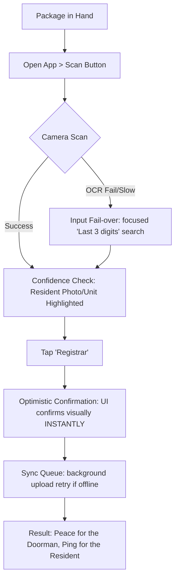
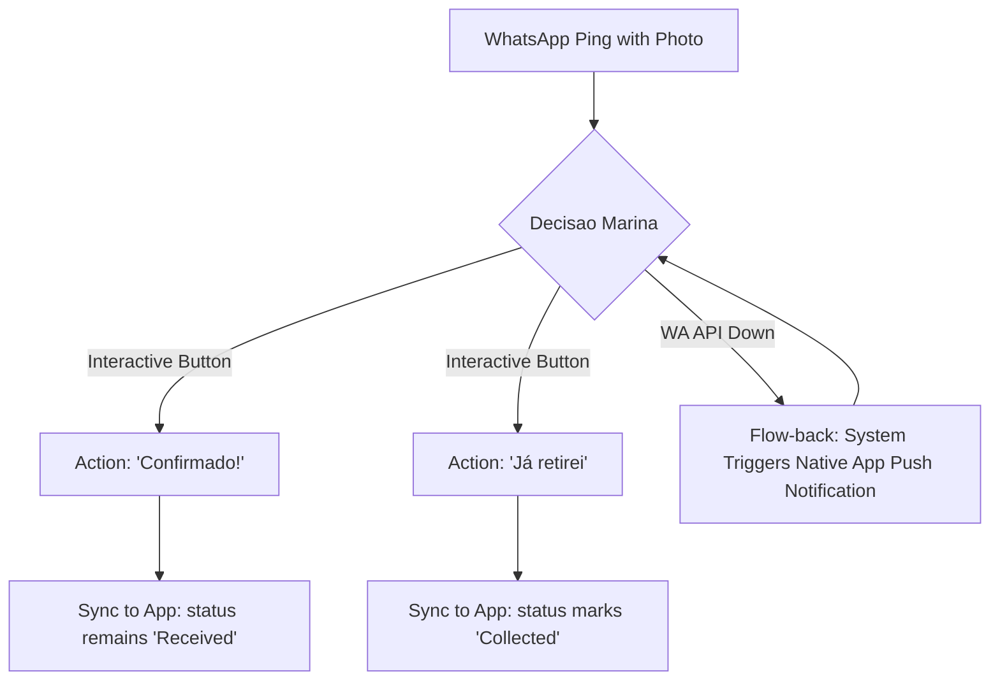

# UX Design Specification condomeet

**Author:** cristiano
**Date:** 2026-02-06

## Executive Summary

### Project Vision
Condomeet is an "Entryway Accelerator." The UI must be optimized for **speed and context**. The current baseline (Bubble.io) relies on static tile grids; the new version will transition to **Dynamic Prioritization**, where the dashboard surfaces specific high-frequency tasks (e.g., pending approvals or arrival scans) based on real-time needs.

### Baseline Synthesis (Current vs. Future)
Based on the internal audit of the current platform:
- **Navigation**: Moving from a "Full Tile Menu" (3x4/4x4 grids) to a "Context-First" layout.
- **Redundancy**: Eliminating the duplication between side-bars and central tiles to reclaim screen real estate.
- **Role Awareness**: The UI will intelligently detect "Admin-as-Resident" profiles to merge registration tools with resident features seamlessly.
- **Actionability**: Transforming "Empty Grids" into "Active Skeletons" or "Insights" (e.g., instead of an empty growth chart, show a "Summary Card" of the last 7 days).

### Target Profiles & Hierarchy
- **Síndico (Manager - "The Admin")**: The gatekeeper of the system. Responsibilities: Configuring common areas, approving/rejecting residents, and managing unit transfers (onboarding/offboarding).
- **Porteiro (Doorman - "The Operator")**: High-speed registration of visits and parcels. Minimalist mobile/tablet view for peak-hour efficiency.
- **Morador (Resident - "The End User")**: Context-aware access to reservations and communications (WhatsApp-First).
- **Zelador (Maintenance)**: Inventory and technical alerts management.

### Key Design Challenges
- **Dynamic Action Hierarchy**: Ordering features based on individual profile usage and configuration by the Síndico.
- **Contextual RBAC**: Ensuring the UI reflects permissions set by the Síndico without visual noise.
- **Zero Lag Feedback**: Instant visual confirmation for high-stakes actions like resident approvals or SOS triggers.

---

## Core User Experience

### Defining Experience
The Condomeet experience is defined by **Immediacy**. For the Doorman, it is the heartbeat of the portal (15s registration). For the Resident, it is the "Quiet Confidence" of knowing exactly when a package arrives without opening an app.

### Platform Strategy
- **Mobile Native (iOS/Android)**: Primary platform for Residents and Doormen. Utilizing Flutter/React Native for 60fps animations.
- **Web Admin (Responsive)**: Primary for the Síndico and Management companies for deep configuration and reporting.
- **Offline-First (Tablet/Mobile)**: Mandatory local cache for the Porteria to ensure 100% availability during Wi-Fi drops.

### Effortless Interactions
- **Predictive Porteria**: The UI suggests the Unit/Resident metadata as soon as the first digit is typed (zero-thought search).
- **Magic Link / Biometrics**: Eliminating password fatigue for Residents.
- **WhatsApp Inline Actions**: Confirming receipt or authorizing visitors directly within the chat interface.

### Critical Success Moments
- **The "Ping" (Aha! Moment)**: When a resident receives the parcel photo via WhatsApp in < 30s after the courier arrives.
- **The Clear Gate**: When the Doorman registers 5 couriers in 2 minutes without a queue forming.
- **The Safe Approval**: When the Síndico approves a new resident with a single swipe, knowing the data is validated.

### Experience Principles
- **Speed is the Feature**: If it takes more than 2 taps, it's too slow.
- **Contextual Intelligence**: Surface what matters *now* (e.g., show "Open Gate" when a pre-authorized visitor is detected).
- **Graceful Offline**: The user should never see a "Connection Lost" screen; the app just works and syncs later.
- **Privacy by Design**: Masking sensitive data while maintaining operational utility.

---

## Desired Emotional Response

### Primary Emotional Goal: **Tranquilidade** (Peace of Mind)
The ultimate measure of UX success is when the user feels that the condominium is "under control" and "silent." No chaos at the gate, no uncertainty about packages, and no bureaucracy for the manager.

### Emotional Journey Mapping
- **Discovery/Onboarding**: **Confidence**. Users feel that the system is professional and worth the transition from legacy paper or Bubble systems.
- **Core Experience (The Portal)**: **Efficiency & Calm**. The porter feels fast without being rushed.
- **Post-Action (The "Ping")**: **Relief**. The resident receives the notification and immediately stops worrying about the courier.
- **Support Moment**: **Trust**. If a sync fails, the clear "Offline Mode" indicator provides assurance that data is safe.

### Micro-Emotions
- **Trust**: Consistent branding and instant feedback.
- **Accomplishment**: Managers feel a dopamine hit when they clear their approval queue.
- **Connection**: Residents feel part of a modern, well-managed community.

### Design Implications
- **Tranquilidade** → **Minimalist UI**: Extreme use of white space to reduce cognitive load. Avoiding "alert fatigue" with subtle but clear typography.
- **Confidence** → **Instant Feedback**: Every tap has a micro-animation or haptic to confirm the system received the intent.
- **Trust** → **Brand Consistency**: Using the core Orange-Red (`#FA542F`) strategically to signal action and safety.

---

## UX Pattern Analysis & Inspiration

### Inspiring Products Analysis
- **Nubank (Minimalist Dashboard)**: Inspires the use of "Clear State" rewards and dynamic prioritization. When a task is done (e.g., an approval), the UI confirms and simplifies the view.
- **Uber/iFood (Real-Time Status)**: Inspires the use of a "Status Tracker" for parcels and visitor arrivals, reducing user anxiety through live progress indicators.
- **WhatsApp (Inline Actions)**: Inspires the use of interactive notifications. Residents should be able to authorize a guest directly from the system alert without multiple app transitions.

### Transferable UX Patterns
- **Role-Dynamic Dashboard**: Separate, specialized views for the Doorman (Operator High-Speed) and the Síndico (Management High-Control).
- **Optimistic UI (Zero-Lag)**: The interface assumes server success and animates state changes immediately, with background synchronization (Crucial for the "Zero Lag" promise).
- **Deep-Linked Authentication**: Biometric validation triggered directly via WhatsApp buttons for seamless "Quick Authorizations."

### Anti-Patterns to Avoid
- **The "Everything-Drawer"**: A side menu with too many options. We will use a flat, context-aware primary navigation.
- **Web-Wrap Latency**: Generic scrolling and jitters. We will use 60fps native list physics to maintain the "Premium" feel.
- **Alert Fatigue**: Excessive non-critical notifications. Silent background updates for non-mission-critical data.

### Design Inspiration Strategy
- **Adopt**: The "One Action at a Time" focus of modern fintech apps for the Doorman interface.
- **Adapt**: The "Package Tracker" visual for condominium parcel management.
- **Avoid**: Legacy PHP-style form grids; move to card-based, touch-optimized layouts.

---

## Design System Foundation

### Design System Choice: **Custom Design System (Tailwind UI Foundation)**
We will build a custom visual language for Condomeet using Tailwind UI as the underlying structural foundation. This allows for professional-grade components while providing the freedom to pivot the aesthetic toward a unique "Premium PropTech" look and feel.

### Rationale for Selection
- **Visual Differentiation**: A custom system ensures Condomeet doesn't look like a generic administrative tool. 
- **Performance (Zero Lag)**: Tailwind's utility-first approach minimizes CSS bloat, supporting the fast-loading tenet.
- **Responsive Fluidity**: Native-like responsiveness is baked into the foundation, facilitating the transition to Flutter/React Native.
- **Developer Efficiency**: Provides high-quality starting points for complex components like data dashboards and resident filters.

### Implementation Approach
- **Base Components**: Tailwind UI (Refined & Headless UI).
- **Core Strategy**: Define a central "Condomeet UI Kit" in Figma and code that maps one-to-one to ensure design-to-production speed.

### Customization Strategy
- **Primary Color Elevation**: Strategically using Brand Orange-Red (`#FA542F`) for action-oriented tokens and critical statuses.
- **The "Tranquilidade" Theme**: Using a palette of soft grays and generous white space to reduce doorman cognitive load during high-traffic hours.
- **Typography**: Adopting a modern, high-readability sans-serif (e.g., Inter or Outfit) optimized for small screens and quick scanning.

---

## 2. Core User Experience (Defining Interaction)

### 2.1 Defining Experience: "The Frictionless Handshake"
The defining experience of Condomeet is the instant, silent transition of a parcel from a courier's hand to the resident's awareness. It is a dual-sided interaction: the **Check-in Relâmpago** (Rapid Check-in) for the Doorman and the **Ping de Alívio** (Relief Ping) for the Resident.

### 2.2 User Mental Model
- **Doorman**: Views the entryway as a "bottleneck" that needs clearing. Mental model: "Identify → Capture → Dispatch."
- **Resident**: Views the parcel as an "anxiety-triggering wait." Mental model: "Is it there yet? → It's safe → I'll get it later."
- **Síndico**: Views the condo as a "system of flows." Mental model: "Is everything orderly? → Are my residents happy?"

### 2.3 Success Criteria
- **Registration Speed**: < 10 seconds from "Package in Hand" to "Notification Sent."
- **Notification Utility**: 90% of residents interact with the notification without opening the full app.
- **System Trust**: 100% data consistency between offline mobile registration and cloud admin dashboards.

### 2.4 Novel UX Patterns
- **OCR-First Discovery**: Using the camera as the primary input for data entry (Unit/Name recognition) rather than typing.
- **Hybrid WhatsApp Workflow**: Treating WhatsApp as a functional "sub-interface" of the app rather than just a messaging channel.

### 2.5 Experience Mechanics (Check-in Relâmpago)
1.  **Initiation**: Doorman taps a single prominent "Registrar" button on the dashboard.
2.  **Interaction**: App opens the camera; Doorman points it at the parcel label. AI/OCR scans and highlights the unit number.
3.  **Feedback**: A haptic pulse and a "Matched" card appear with the resident's name and photo.
4.  **Completion**: Doorman taps the card; an "Optimistic UI" checkmark appears immediately, and the resident is notified in background.

---

## 5. User Journey Flows (Resilient Mechanics)

### 5.1 Journey 1: Check-in Relâmpago (Doorman)
**Goal**: Register arrival with zero friction, even in high-traffic or connectivity-limited scenarios.



### 5.2 Journey 2: Ping de Alívio (Resident)
**Goal**: Immediate peace of mind through WhatsApp-led interaction without app overhead.



### 5.3 Journey 3: Aprovação Segura (Manager)
**Goal**: Zero-error management of newcomer requests.

```mermaid
graph TD
    A[New Approval Notification] --> B[Manager Dashboard]
    B --> C[View Document Detail]
    C --> D{Swipe Decision}
    D -->|Right| E[Approve: Automated Welcome WhatsApp Sent]
    D -->|Left| F[Reject: Pop-up for 'Reason']
    E --> G[Visual Reversal: Toast says 'Undoing Approval (5s)']
    F --> G
```

### 5.4 Resilient UX Patterns
- **Input Fail-over**: Never make the user wait for a failed AI scan. If OCR skips a beat, the manual backup is already focused.
- **Optimistic UI**: The app "lies" for good (confirming success immediately while background-syncing) to maintain the "Zero Lag" feel.
- **Contextual Redundancy**: If WhatsApp fails (the #1 channel), the system auto-escalates to native Push within 15 seconds.

### 5.5 Flow Optimization Principles
- **The 3-Tap Rule**: No vital operation (Register, Authorize, Reserve) can take more than 3 taps.
- **Haptic Certainty**: Subtle vibration feedback for every successful state change to ground the "Zero Lag" promise.

---

## 6. Component Strategy

### 6.1 Design System Components (Tailwind UI Foundation)
We will leverage high-quality base components from Tailwind UI to ensure speed and accessibility:
- **Navigation**: Sidebars (Admin), Bottom Tabs (Mobile).
- **Forms**: Refined inputs, Toggle switches, and Select menus.
- **Overlays**: Modals (Success/Error), Slide-overs (Detail views).
- **Data Display**: Tables (Admin Lists), Grids (Reservation Calendars).

### 6.2 Custom Components (The "Soul" of Condomeet)
- **Scanner Overlay (OCR)**: A custom viewport for the Doorman app with focal guides and real-time text detection feedback.
- **Match Card (Portaria)**: High-visibility result cards showing Resident Photo + Unit number for fast visual confirmation.
- **Dynamic SOS Button**: A pulsing emergency trigger that transforms into a status tracker when activated.
- **WhatsApp Action Card**: Interactive templates optimized for one-tap confirmations directly in the chat.
- **Offline Sync Badge**: Real-time status indicator that shifts between "Live" and "Local Cache" modes.

### 6.3 Component Implementation Strategy
- **Token-Based**: All custom components will inherit color and spacing tokens from the Visual Foundation to maintain thematic consistency.
- **Feedback-Rich**: Every active component must have a `processing` state and an `optimistic success` state.
- **Accessible by Default**: Semantic HTML and ARIA labels for all custom interactive parts.

### 6.4 Implementation Roadmap
- **Phase 1 (MVP Critical)**: Scanner Overlay, Match Cards, Basic Layout Shells.
- **Phase 2 (UX Enhancers)**: WhatsApp Action Cards, SOS Button, Dashboard Stats.
- **Phase 3 (Optimization)**: Detailed Offline Badges, Micro-animations, Advanced Filtering UI.

---

## 7. UX Consistency Patterns (Decision Records)

### 7.1 Action Hierarchy & Button Patterns
- **Primary (Call to Action)**: Brand Orange-Red (`#FA542F`) - solid. Used for the singular most important action on a screen (e.g., 'Registrar Encomenda').
- **Secondary (Support)**: Outlined brand color. For flows that assist the primary (e.g., 'Ver Histórico').
- **Status-Driven Buttons**: Buttons reflect their outcome. A 'Delete' action uses destructive red; 'Approve' uses success green.

### 7.2 Feedback Patterns (Zero-Lag Guarantee)
- **Haptic Pulse**: Every primary success (Scan Match, Form Submit) triggers a 20ms haptic tap on mobile/tablet.
- **Optimistic Confirmation**: UI state updates *before* server confirmation.
- **Gracious Rollback**: If an optimistic update fails (e.g., network error), the UI reverts to the previous state with a subtle notification ("Ops! Notificação falhou, tentando novamente...").

### 7.3 Data Loading & Performance Patterns
- **Blur-up Image Loading**: High-resolution resident photos are loaded as low-res placeholders first to ensure scroll and swipe (60fps) are never blocked by asset fetching.
- **Skeleton States**: Contextual skeletons that match the exact layout of the eventual data (e.g., card skeletons for the approval queue).

### 7.4 Form & Input Focus
- **Autofocus Inheritance**: Entry points (e.g., The Porter's Search) always autofocus on mount. On mobile, the correct keyboard type (Numeric vs. Text) is pre-selected.
- **Validation-as-you-type**: Red/Green strokes on input borders provide instant non-blocking feedback.

### 7.5 Signature Interaction Pattern
- **Swipe-to-Decide**: Multi-card queues (Resident Approvals, Ocorrencias) use a 'Swipe Right' for accept and 'Swipe Left' for reject/review, providing a satisfying "clearing the deck" feeling for the manager.

---

## 8. Responsive Design & Accessibility (Universal Access)

### 8.1 Universal Device Strategy
The Condomeet UI is built on a **"Feature Parity, Screen Flexibility"** model. Residents, Doormen, and Managers must have 100% access to their tools whether they are on a phone, tablet, or desktop.

- **Any User, Any Device**: 
    - **Porteiro / Doorman**: Can operate from a smartphone if the tablet is down. The UI shifts from a two-column "Scan & List" to a focused "Scan-First" mobile flow.
    - **Síndico / Manager**: Can approve residents on-the-go via smartphone or perform deep stock audits on a desktop.
    - **Morador / Resident**: Can book common areas via a laptop or receive and confirm parcels via their mobile device.

### 8.2 Breakpoint Strategy (Tailwind Foundation)
- **Compact (Mobile: <768px)**: Bottom-tab navigation, full-width cards, large touch targets (48px+). Focus on thumb-driven interaction.
- **Medium (Tablet: 768px - 1024px)**: Dual-pane layouts (side list + detail view). Optimized for horizontal or vertical orientation.
- **Large (Desktop: >1024px)**: Expanded sidebar, multi-column metrics, and deep data grids for administrative tasks.

### 8.3 Accessibility Compliance (WCAG 2.1 Level AA)
- **Visual Hygiene**: High color contrast (4.5:1 ratio) for all text. Essential for outdoor portaria visibility.
- **Inclusive Navigation**: Semantic HTML ensuring screen readers (VoiceOver/TalkBack) can read parcel statuses and instructions clearly.
- **Safety First**: Destructive actions (Delete/SOS) require a 2-step confirmation or a "Long Press" to prevent accidental triggers on small devices.

### 8.4 Testing & Performance GATE
- **Lightweight Assets**: Use of SVG icons and system fonts to ensure fast loading on 3G/4G connections.
- **The "Sun-Glare" Test**: High-contrast UI mode available for outdoor portaria scenarios.

---

<!-- UX design content will be appended sequentially through collaborative workflow steps -->
